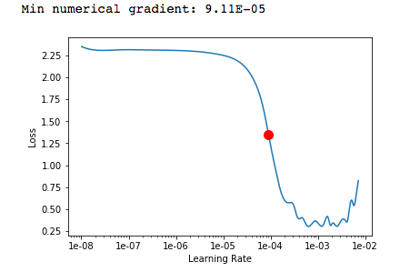

# PyTorch Learning Rate Finder
PyTorch Implementation of Fastai's Learning Rate Finder. 

The learning rate finder measures a model's training loss over a range of learning rates and suggests an optimal learning rate. 

The approach is based on [Leslie Smith's Cyclical Learning Rates for Training Neural Networks](https://arxiv.org/abs/1506.01186). In the paper, Smith cycles through each mini-batch, increasing the learning rate linearly between two booundaries and records the validation loss. 

This repo has been adapted according to fastai's [implementation](https://github.com/fastai/fastai) of Smith's Cyclical Learning Rates. In this version, the learning rate is increased exponentially between two boundaries and the training loss (not the validation) is recorded. While not a precise as Smith's version, this approach is much faster. 

In the plot below, the red dot indicates the optimal learning rate.



#### Note
Prior to plotting, the loss data is run through a smoothing function, which makes the plot more legible. However, in some cases this can lead to errors in the calculation of the `optimal_learning_rate`. As Smith outlines, the point where the decrease in training loss is greatest, represents a good learning rate choice.     

## Requirements

- Python 3 and above
- pip
- see `requirements.txt`

## Example Usage

```python
model = ...
criterion = nn.CrossEntropyLoss()
optimizer = optim.SGD(net.parameters(), momentum=0.9)
learning_rate_tuner = LearningRateTuner(
    net=net,
    criterion=criterion,
    optimizer=optimizer,
    data_loader=trainloader
)
optimal_learning_rate = learning_rate_tuner.tune_learning_rate()
```

### Notebooks

- Two sample notebooks (CIFAR10, MNIST) are included in the notebooks folder.